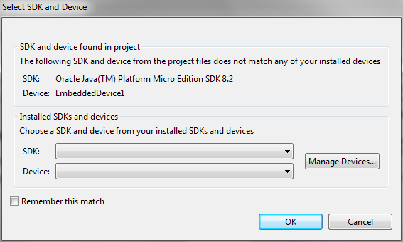
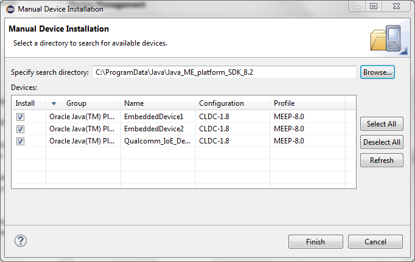
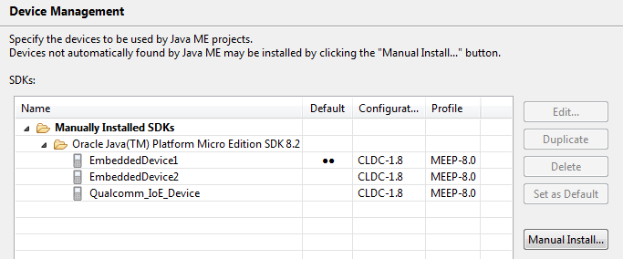

Java ME Demo
==================

Units of Measurement API Demo for Java ME 8 Embedded

## Steps to Run

### Eclipse

Follow [Installing the Java ME SDK Plug-ins for Eclipse IDE](http://docs.oracle.com/javame/8.2/sdk-dev-guide/install.htm#A132728297 "Installing the Java ME SDK Plug-ins for Eclipse IDE") to install the Eclipse plug-ins for Java ME 8.2 SDK. And all necessary prerequisites (e.g the Java ME SDK 8.2 itself if you haven't done so) The plug-ins require Eclipse **Mars (4.5)** or higher.

After installing the Eclipse plug-ins, start Eclipse with a new empty workspace.

If you haven't done so, clone 

- [unit-api](../../../../../unit-api)
- [unit-ri](../../../../../unit-ri)
- [uom-demos](../../../../) (if you're reading this online and not on your local filesystem;-)

Import - Existing Maven Projects:

- ${git_dir}/unit-api
- ${git_dir}/unit-api

Import - Existing Projects into Workspace:

- ${git_dir}/uom-demos/javame/medemo

You'll be promted to select an SDK and Device(s)

Click "Manage Devices..."
And in the Device Management dialog "Manual Install..."

Point to the installation folder of Java ME SDK 8.2, see:

After scanning the SDK folder Device Management should look like this:

Confirming Device Management will populate the SDK and Device dropdown. Defaults normally do, it should be "EmbeddedDevice1" or the device marked as "Default" in the Device Management dialog.

### NetBeans

See [Installing the Java ME SDK Plug-ins for NetBeans IDE](http://docs.oracle.com/javame/8.2/sdk-dev-guide/install.htm#A1147985 "Installing the Java ME SDK Plug-ins for NetBeans IDE") for NetBeans support of the Java ME 8 SDK and any prerequisites.

NetBeans support for Java ME 8.2 SDK is currently picky about libraries it can use.
Although libraries backed by JAR files should work, it currently won't load unless the classes are provided in an "exploded JAR" / "classes" folder.

